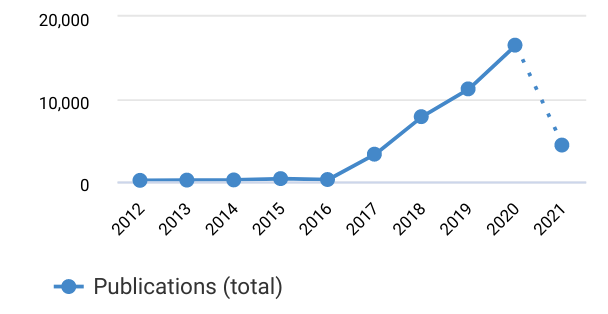
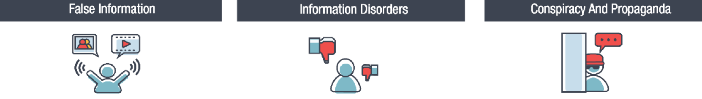
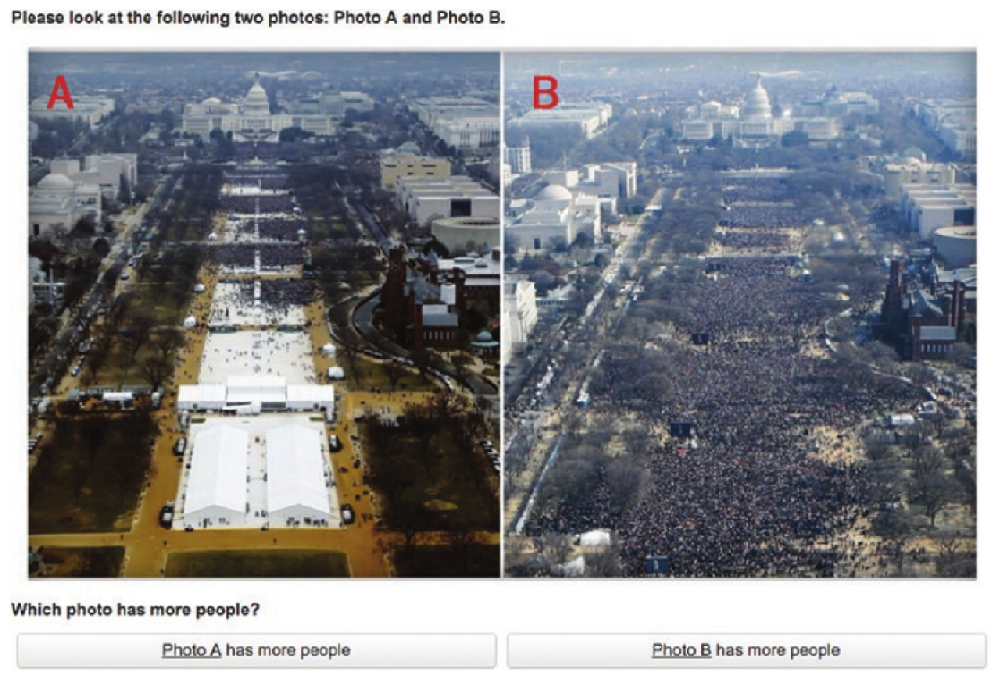
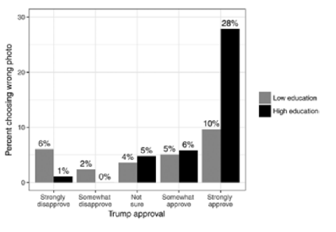

# Topics

## 1. Misinformation and collaborative propaganda

---

# The hot topic of fake news

```{r, echo=FALSE, out.width=1000}

```

---

# Terminology about misinformation

```{r, echo=FALSE, out.width=1200}

```

- **False information:** 
  - False or fake news: news-like content that is verifiably false
  - False rumours: General talk or hearsay not based on factual knowledge
  - Factitious information blends: half-truths and speculations
  - Satire and parody
  - Deep fakes and cheap fakes
  
<div style="font-size:15pt">
Technology and democracy: Understanding the influence of online technologies on political behaviour and decision-making. Stephan Lewandowsky, Laura Smillie, David Garcia, Ralph Hertwig, Jim Weatherall, Stefanie Egidy, Ronald E. Robertson, Cailin O’connor, Anastasia Kozyreva, Philipp Lorenz-Spreen, Yannik Blaschke, and Mark Leiser. (2020)
</div>
 

---

# Terminology about misinformation

```{r, echo=FALSE, out.width=1200}

```

- **Information disorders:** 
  - Misinformation: false or misleading content shared without malicious intent
  - Disinformation: false or fabricated content shared with the intent to mislead or cause harm
  - Malinformation: true information shared to cause harm (hate speech, private information)

<div style="font-size:15pt">
Technology and democracy: Understanding the influence of online technologies on political behaviour and decision-making. Stephan Lewandowsky, Laura Smillie, David Garcia, Ralph Hertwig, Jim Weatherall, Stefanie Egidy, Ronald E. Robertson, Cailin O’connor, Anastasia Kozyreva, Philipp Lorenz-Spreen, Yannik Blaschke, and Mark Leiser. (2020)
</div>

---

# Terminology about misinformation

```{r, echo=FALSE, out.width=1200}

```

- **Propaganda:** Information, especially of a biased or misleading nature, used to promote a political cause or point of view. Can be political or industrial
- **Systematic lies:** Carefully constructed fabrications or obfuscations (e.g. weapons of mass destruction in Irak)
- **Conspiracy theories:** Alternative explanations for traditional news events which assume that these events are controlled by a secret elite group

<div style="font-size:15pt">
Technology and democracy: Understanding the influence of online technologies on political behaviour and decision-making. Stephan Lewandowsky, Laura Smillie, David Garcia, Ralph Hertwig, Jim Weatherall, Stefanie Egidy, Ronald E. Robertson, Cailin O’connor, Anastasia Kozyreva, Philipp Lorenz-Spreen, Yannik Blaschke, and Mark Leiser. (2020)
</div>

---

## Collaborative propaganda and politicization

```{r, echo=FALSE, out.width=530}

```
```{r, echo=FALSE, out.width=540}

```

<div style="font-size:15pt">
Misinformation or expressive responding? What an inauguration crowd can tell us about the source of political misinformation in surveys. Schaffner & Luks. Public Opinion Quarterly (2018)
</div>

---
 
