```{r xaringan-themer, include=FALSE, warning=FALSE}
#This block contains the theme configuration for the CSS lab slides style
library(xaringanthemer)
library(showtext)
style_mono_accent(
  base_color = "#5c5c5c",
  text_font_size = "1.5rem",
  header_font_google = google_font("Arial"),
  text_font_google   = google_font("Arial", "300", "300i"),
  code_font_google   = google_font("Fira Mono")
)
```

```{r setup, include=FALSE}
options(htmltools.dir.version = FALSE)
```


layout: true
<div class="my-footer"><span>David Garcia - Computational Social Science Lab - TU Graz + CSH Vienna</span></div> 

---
class:center
# About me

.pull-left[
```{r, echo=FALSE, out.width=270}
knitr::include_graphics("figures/Profile.jpg")
```
]

.pull-right[
<br>
Website: [dgarcia.eu](https://dgarcia.eu)

Twitter: [@dgarcia_eu](https://twitter.com/dgarcia_eu)

Github: [dgarcia-eu](https://github.com/dgarcia-eu)

Email: dgarcia@tugraz.at
]

Professor for Computational Behavioral and Social Sciences at TU Graz
<br>Faculty member of the Complexity Science Hub Vienna
<br>Group leader at the Medical University of Vienna
<br>**Masters Programme in Computational Social Systems from October 2021!**

---

# The Computational Social Science Lab

<center>
```{r, echo=FALSE, out.width=650}
knitr::include_graphics("figures/Lab.png")
```

---
<center>
```{r, echo=FALSE, out.width=900}
knitr::include_graphics("figures/CSSinfo.png")
```
### Our aim is to understand human behavior and socio-technical phenomena in the digital society
---

# Topics

## 1. Misinformation and collaborative propaganda

## 2. Food-based polarization: the EAT-Lancet case

## 3. Politicization of medical preprints 

## 4. A computational model of hyperpolarization

## 5. Misinformation and ontologies of truth

---


# Topics

## 1. Misinformation and collaborative propaganda

---

# The hot topic of fake news

```{r, echo=FALSE, out.width=1000}
knitr::include_graphics("figures/fakenews.png")
```

---

# Terminology about misinformation

```{r, echo=FALSE, out.width=1200}
knitr::include_graphics("figures/misinfoClasses.png")
```

- **False information:** 
  - False or fake news: news-like content that is verifiably false
  - False rumours: General talk or hearsay not based on factual knowledge
  - Factitious information blends: half-truths and speculations
  - Satire and parody
  - Deep fakes and cheap fakes
  
<div style="font-size:15pt">
Technology and democracy: Understanding the influence of online technologies on political behaviour and decision-making. Stephan Lewandowsky, Laura Smillie, David Garcia, Ralph Hertwig, Jim Weatherall, Stefanie Egidy, Ronald E. Robertson, Cailin O’connor, Anastasia Kozyreva, Philipp Lorenz-Spreen, Yannik Blaschke, and Mark Leiser. (2020)
</div>
 

---

# Terminology about misinformation

```{r, echo=FALSE, out.width=1200}
knitr::include_graphics("figures/misinfoClasses.png")
```

- **Information disorders:** 
  - Misinformation: false or misleading content shared without malicious intent
  - Disinformation: false or fabricated content shared with the intent to mislead or cause harm
  - Malinformation: true information shared to cause harm (hate speech, private information)

<div style="font-size:15pt">
Technology and democracy: Understanding the influence of online technologies on political behaviour and decision-making. Stephan Lewandowsky, Laura Smillie, David Garcia, Ralph Hertwig, Jim Weatherall, Stefanie Egidy, Ronald E. Robertson, Cailin O’connor, Anastasia Kozyreva, Philipp Lorenz-Spreen, Yannik Blaschke, and Mark Leiser. (2020)
</div>

---

# Terminology about misinformation

```{r, echo=FALSE, out.width=1200}
knitr::include_graphics("figures/misinfoClasses.png")
```

- **Propaganda:** Information, especially of a biased or misleading nature, used to promote a political cause or point of view. Can be political or industrial
- **Systematic lies:** Carefully constructed fabrications or obfuscations (e.g. weapons of mass destruction in Irak)
- **Conspiracy theories:** Alternative explanations for traditional news events which assume that these events are controlled by a secret elite group

<div style="font-size:15pt">
Technology and democracy: Understanding the influence of online technologies on political behaviour and decision-making. Stephan Lewandowsky, Laura Smillie, David Garcia, Ralph Hertwig, Jim Weatherall, Stefanie Egidy, Ronald E. Robertson, Cailin O’connor, Anastasia Kozyreva, Philipp Lorenz-Spreen, Yannik Blaschke, and Mark Leiser. (2020)
</div>

---

## Collaborative propaganda and politicization

```{r, echo=FALSE, out.width=530}
knitr::include_graphics("figures/capitol.png")
```
```{r, echo=FALSE, out.width=540}
knitr::include_graphics("figures/capitol2.png")
```

<div style="font-size:15pt">
Misinformation or expressive responding? What an inauguration crowd can tell us about the source of political misinformation in surveys. Schaffner & Luks. Public Opinion Quarterly (2018)
</div>

---

# Topics

## 1. Misinformation and collaborative propaganda

## 2. Food-based polarization: the EAT-Lancet case

---

## Emerging politicization of food habits
.pull-left[
- US Food demand Survey

- Self-reported meat consumption intention over time

- Color: party alignment

- Initial increasing trend for both parties

- Start of alignment with party from 2016: eating meat becomes a political issue

]
.pull-right[

```{r, echo=FALSE, out.width=450}
knitr::include_graphics("figures/Trends.png")
```
]
---

## Misinformation about food and climate policy
```{r, echo=FALSE, out.width=650, fig.align='center'}
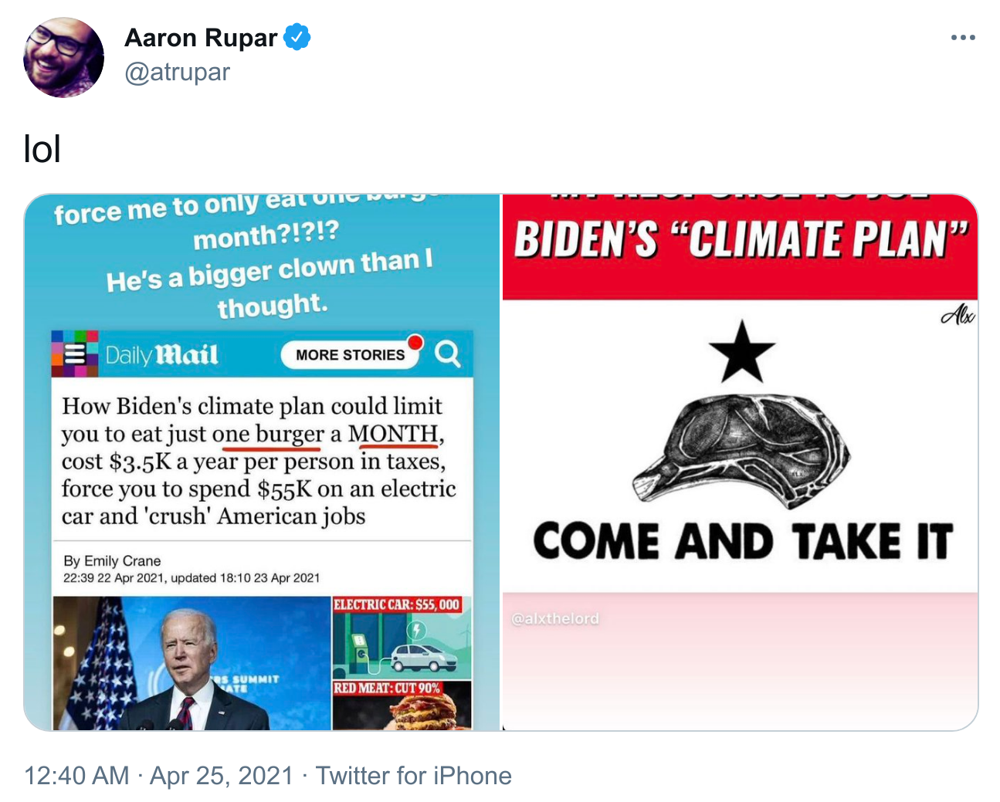
```
---


layout: true
<div class="my-footer"><span>
<a href=https://doi.org/10.1016/S0140-6736(19)32526-7> EATLancet vs yes2meat: the digital backlash to the planetary health diet. David Garcia, Victor Galaz, Stefan Daume. The Lancet (2019)</a></span></div>

---
## The EAT-Lancet report

```{r, echo=FALSE, out.width=1000}
knitr::include_graphics("figures/eatlancet.png")
```

*The first full scientific review of what constitutes a healthy diet from a sustainable food system, and which actions can support and speed up food system transformation. (eatforum.org)*

---

## \#yes2meat: the digital backlash to EAT-Lancet

```{r, echo=FALSE, out.width=1100}
knitr::include_graphics("figures/yes2meat.png")
```
---
## Conspiracy theories in \#yes2meat
```{r, echo=FALSE, out.width=780, fig.align='center'}
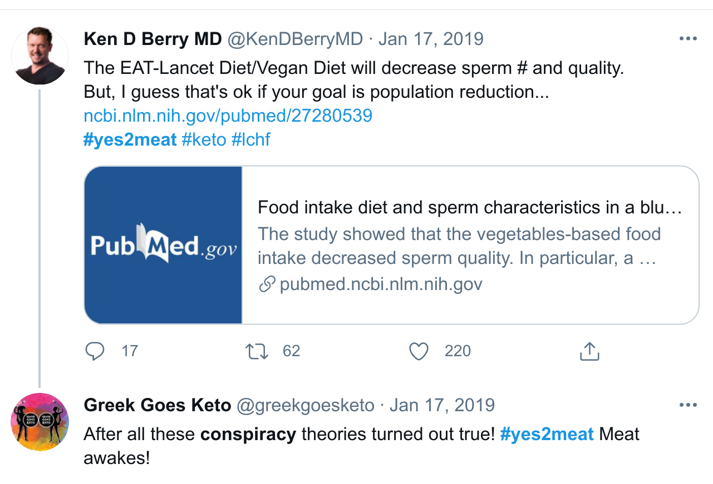
```
---

## Twitter data on EAT-Lancet and yes2meat

- List of original tweets that contain “EAT-Lancet” (or similar) or “yes2meat” from Twitter search interface (Dec 2018 - April 2019):
  - 7281 EAT-Lancet tweets, 8586 yes2meat tweets, 347 tweets mention both
- Tweet metadata from Twitter API: retweets, links, user profile (4278 users)
  - User profiles and self-description from Twitter API
  - Retrieved list of accounts they follow: 4.9 Million follower links
  - Retrieved timeline up to last (approx)  3200 tweets. 8 Million tweets in total
  - Analyzed automated behavior with botometer (4,203 users)
  - 2,376 unique links shared from tweets

- Manual sentiment annotations (Pro EAT-Lancet, Against EAT-Lancet, neutral, irrelevant) for various samples (top URLS and samples from each community)
---

class:center

## Time series and URL shares

```{r, echo=FALSE, out.width=950}
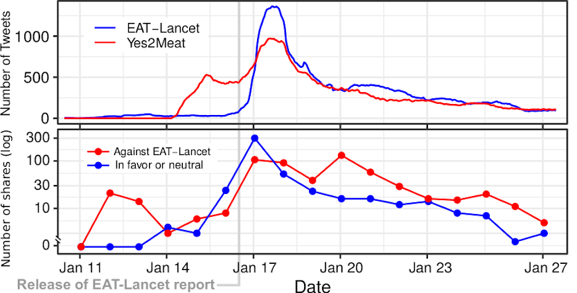
```

---

## Social network analysis
.pull-left[
```{r, echo=FALSE, out.width=500}
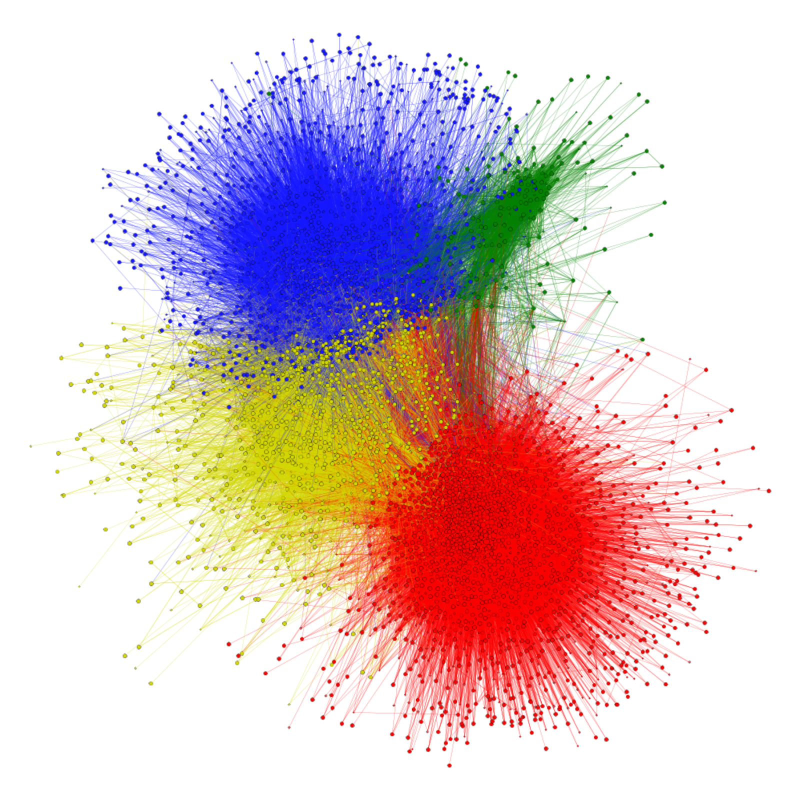
```
]
.pull-right[

]
---

## Social network analysis
.pull-left[
```{r, echo=FALSE, out.width=500}

```
]
.pull-right[
```{r, echo=FALSE, out.width=950}
knitr::include_graphics("figures/WCblue.png")
```
]
---

## Social network analysis
.pull-left[
```{r, echo=FALSE, out.width=500}

```
]
.pull-right[
```{r, echo=FALSE, out.width=950}
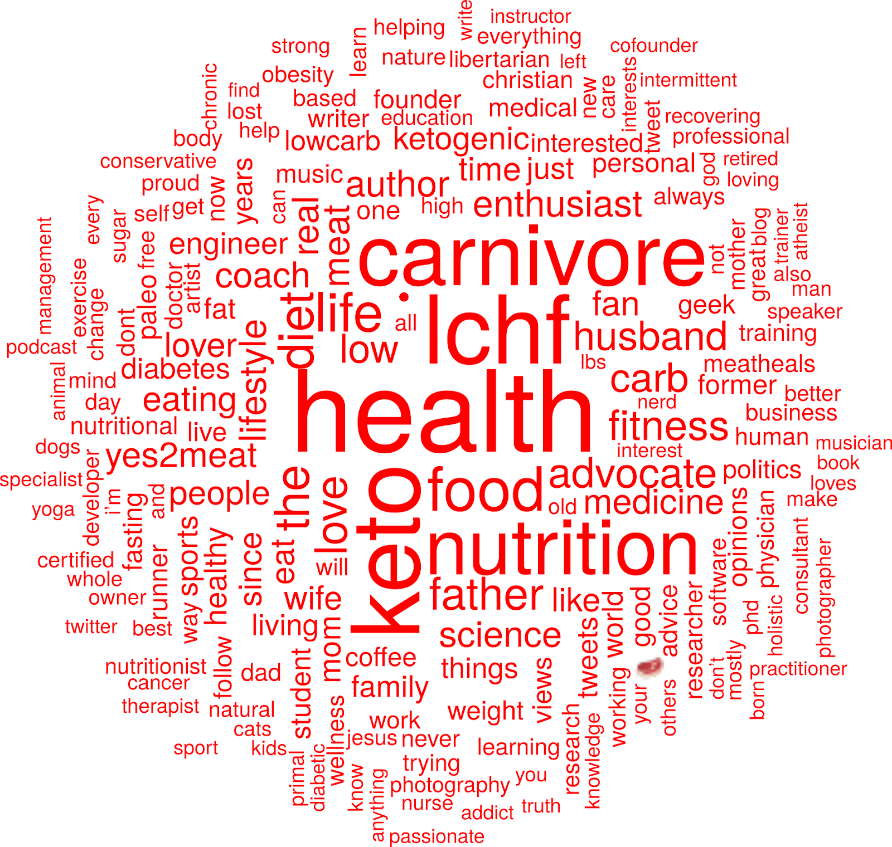
```
]
---

## Social network analysis
.pull-left[
```{r, echo=FALSE, out.width=500}

```
]
.pull-right[
```{r, echo=FALSE, out.width=490}
knitr::include_graphics("figures/WCgreen.png")
```
]
---

## Social network analysis
.pull-left[
```{r, echo=FALSE, out.width=500}

```
]
.pull-right[
```{r, echo=FALSE, out.width=950}
knitr::include_graphics("figures/WCyellow.png")
```
]
---

## Retweet changes in yellow community
.pull-left[
```{r, echo=FALSE, out.width=500}

```
]
.pull-right[
```{r, echo=FALSE, out.width=450}
knitr::include_graphics("figures/YellowRT.png")
```
]
---

## EAT-Lancet and yes2meat: Summary

- We mapped the digital backlash to EAT-Lancet on Twitter through #yes2meat

- Birth of #yes2meat preceded the release of the report

- Four communities: pro-EAT-Lancet, skeptic, pro-yes2meat, and vegan

- Information flow from pro-yes2meat to skeptic community after report

- Diet polarization: liberal vegan vs conservative keto


**EATLancet vs yes2meat: the digital backlash to the planetary health diet.**  
David Garcia, Victor Galaz, Stefan Daume. The Lancet 394(10215) (2019)
https://doi.org/10.1016/S0140-6736(19)32526-7

---

layout: true
<div class="my-footer"><span> <a href=https://preprints.jmir.org/preprint/25169> 
COVID-19 and the politicisation of medical preprints on Twitter: Quantitative Analysis of Social Media Data. Aleksandra Urman, Stefania Ionescu, David Garcia, Anikó Hannák (2020) </a></span></div>

---

# Topics

## 1. Misinformation and collaborative propaganda

## 2. Food-based polarization: the EAT-Lancet case

## 3. Politicization of medical preprints 

---
## The Santa Clara paper controversy
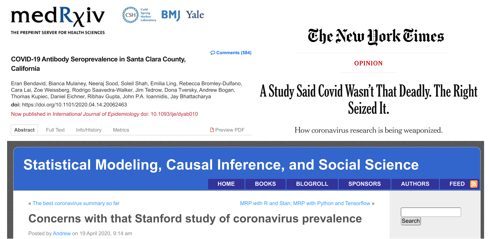

---

## A dataset of medical preprints on Twitter
All tweets that had a link to a medRxiv paper between June 2019 and June 2020 
.pull-left[
- 557,405 tweets, 259,491 users
- Classification of users based on their bio profile text: 
  - 1,944 Democrats, 
  - 9,174 Republicans
  - 8,400 medics
  - 15,400 scientists
- We normalise metrics against a random sample of tweets from the same period.
]
.pull-right[
```{r, echo=FALSE, out.width=800, fig.align='center'}
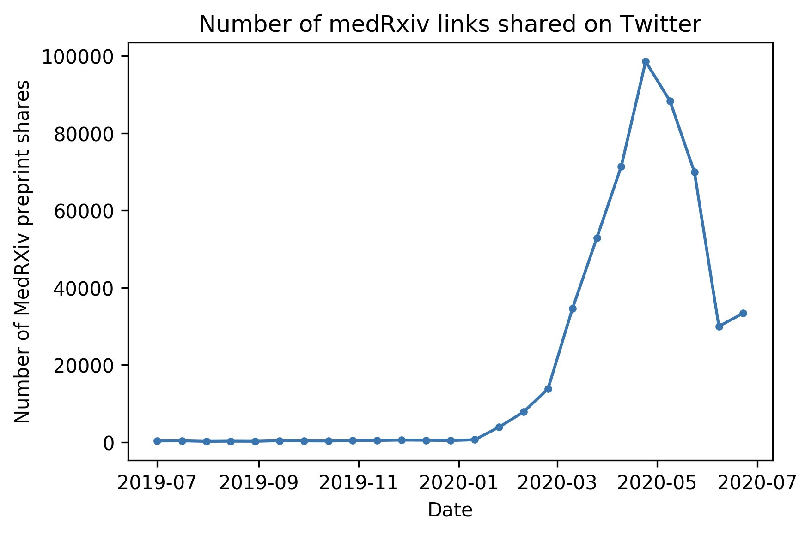
```
]

---
## A change in voice
```{r, echo=FALSE, out.width=670, fig.align='center'}
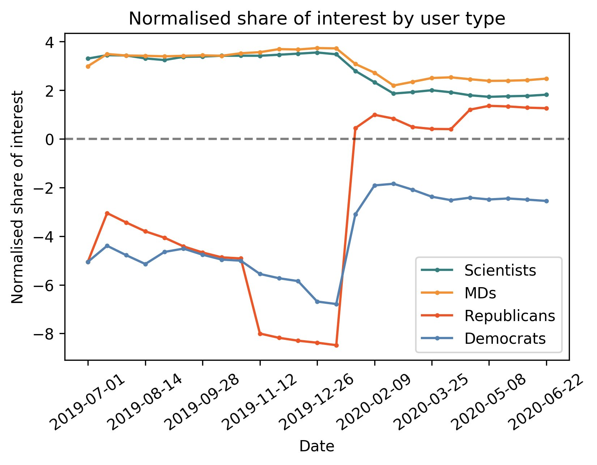
```
---
## The Santa Clara paper case
```{r, echo=FALSE, out.width=1000, fig.align='center'}
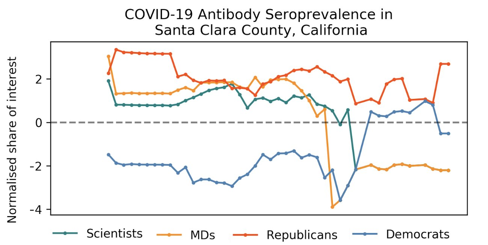
```
---
## From "preprint" to "study"
```{r, echo=FALSE, out.width=900, fig.align='center'}
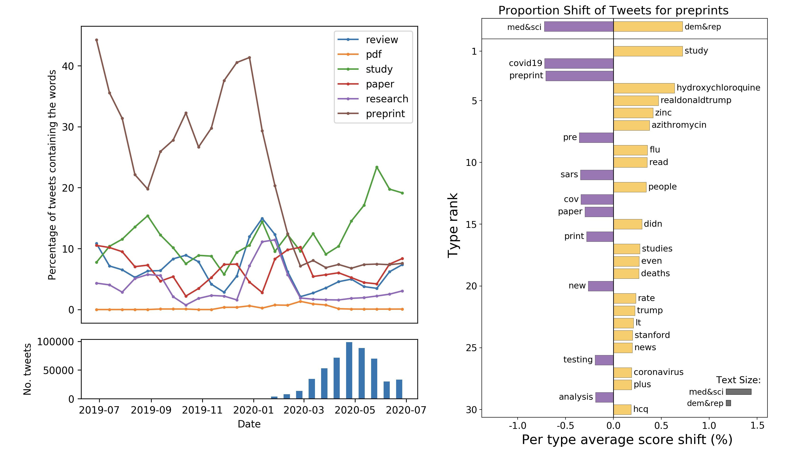
```
---
## Science communication in the digital society
```{r, echo=FALSE, out.width=1250, fig.align='center'}
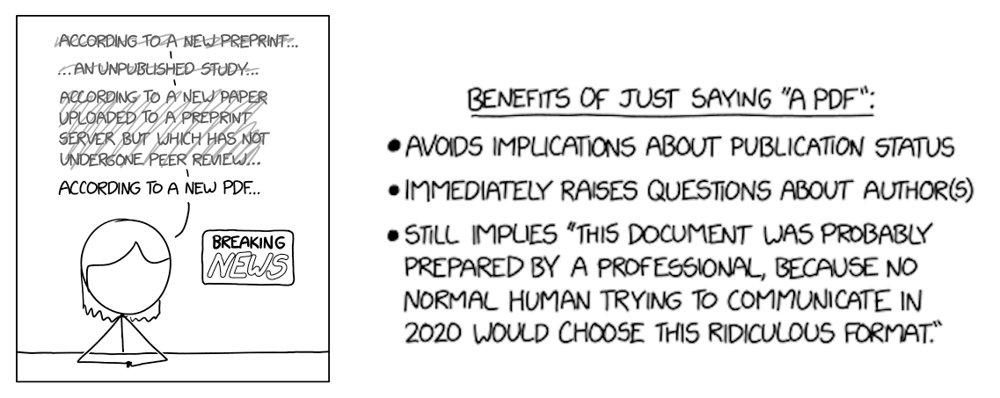
```
---


layout: true
<div class="my-footer"><span>
<a href=http://jasss.soc.surrey.ac.uk/23/3/5.html> A Weighted Balance Model of Opinion Hyperpolarization. Simon Schweighofer, Frank Schweitzer & David Garcia, JASSS (2020)</a></span></div>

---
# Topics

## 1. Misinformation and collaborative propaganda

## 2. Food-based polarization: the EAT-Lancet case

## 3. Politicization of medical preprints 

## 4. A computational model of hyperpolarization

---

# Hyperpolarization

```{r, echo=FALSE, out.width=950, fig.align='center'}
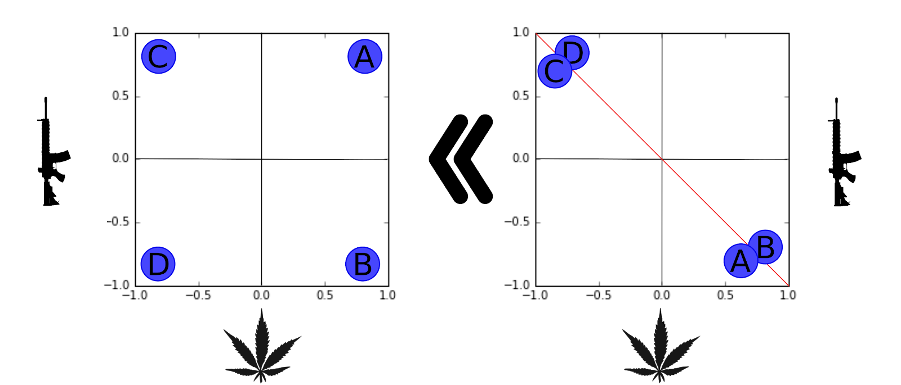
```
<center>
*Hyperpolarization: Opinion extremeness x Opinion constraint*

---

## Weighted Balance Theory and hyperpolarization

.pull-left[
- Cognitive balance +   
 evaluative extremeness

- ABM show emergence of hyperpolarization

- Filter bubbles and echo chambers are not a necessary condition

- **Predicts that issues become aligned and polarized over time**
]

.pull-right[
```{r, echo=FALSE, out.width=450}
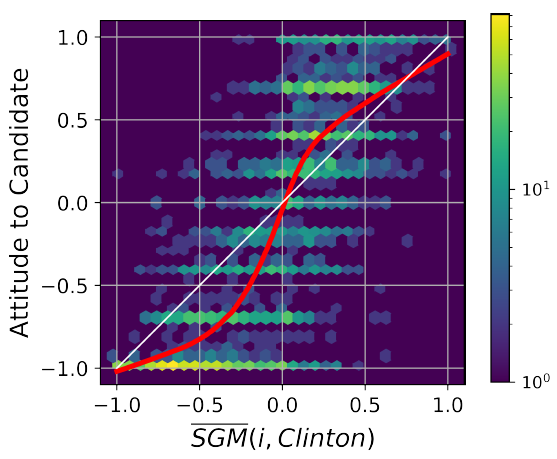
```
]

[A Weighted Balance Model of Opinion Hyperpolarization. Schweighofer, Schweitzer & Garcia, JASSS (2020)](http://jasss.soc.surrey.ac.uk/23/3/5.html)

---
class:center

## Hyperpolarization in Weighted Balance Theory


<iframe width="800" height="500" src="https://www.youtube.com/embed/y4rvLMgqwXQ" frameborder="0" allow="accelerometer; autoplay; encrypted-media; gyroscope; picture-in-picture" allowfullscreen></iframe>

---

# Topics

## 1. Misinformation and collaborative propaganda

## 2. Food-based polarization: the EAT-Lancet case

## 3. Politicization of medical preprints 

## 4. A computational model of hyperpolarization

## 5. Misinformation and ontologies of truth

---

## Deliberate lies vs shock and chaos
.pull-left[
Two approaches to mislead the public:
- **deliberate lies** (e.g weapons of mass destruction in Iraq)
- **shock and chaos** (e.g. Trump's approach, Russia and MH17)
]
.pull-right[
```{r, echo=FALSE, out.width=250}

```
```{r, echo=FALSE, out.width=270}

```
]
They differ in their **ontology of truth:**</br>
- deliberate lies assume a strong realism with the acceptance that truths exist and a respect for facts</br>
- shock and chaos assumes a strong constructivism where there is disbelief in the existence of external truths and a
disrespect of facts.
---

#### PRODEMINFO: Protecting the Democratic Information Space in Europe

```{r, echo=FALSE, out.width=600, fig.align='center'}
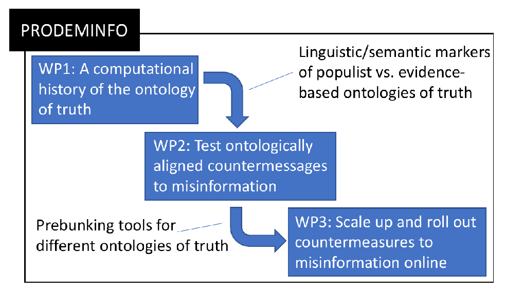
```

- ERC Advanced project (PI: Stephan Lewandowsky, Bristol)
- CSS lab involved in historical text analysis and field interventions
- Parallel project: inoculation experiments with Sander van der Linden, funded by Google Jigsaw and supported by Twitter with free ads
---

## Summary

- Misinformation beyond fake news: 
  - participatory propaganda 
  - new ontologies of truth: shock and chaos

- The EAT-Lancet case: emerging polarization in food topics

- The case of medical preprints on Twitter: increasing politicization

- Weighted Balance computational model explains increasing politicization

- PRODEMINFO: studying ontologies of truth to protect information spaces

**Thanks for listening! More at [www.dgarcia.eu](https://dgarcia.eu) and [@dgarcia_eu](https://twitter.com/dgarcia_eu)**


